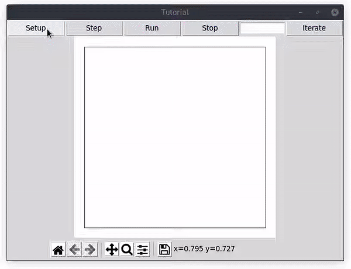

# Tutorial

In this tutorial, loosely based on Netlogo's, we will create a simple model where agents move around, eat, reproduce and die. The model illustrates several of the capabilities included in the package.

## Creating the Agents

The agents in QuAESit inherit from the Agent class. The class has many in-built methods that facilitate common agent procedures in agent-based models. Let's define our class and call it Turtle (as a tribute to Netlogo).

```python
  from quaesit import Agent
  
  
  class Turtle(Agent):
    def __init__(self, energy, world, coords=None):
      super().__init__(world, coords)
      self.energy = energy
```
We must pass, as arguments, at least a World object (we will define that later) and a tuple of x,y coordinates. When coordinates are not specified, random coordinates are assigned to the agent. Our turtles will also have a property called <code>energy</code>.
Every agent is also given a unique id, a random color and a dot icon for display in the GUI. You can override those attributes, e.g. specifying a different <code>self.color</code> and <code>self.icon</code> following matplotlib conventions. Another property that an agent has by default is <code>breed</code> (the same terminology of Netlogo). It is automatically generated (in lowercase) from the class name.

Every agent must have a method called <code>step()</code>, which calls the methods to be executed at each step of the model.

```python
  def step(self):
    self.move()
    self.eat()
    self.reproduce()
    self.check_death()
```
In our case, let's make the agents move randomly, eat food (if there is any available), check if they have enough energy to reproduce and, in case they are out of energy, die. Let's now define each of those methods:

```python
  def move(self):
    self.random_walk()
    self.energy -= 1

  def eat(self):
    pass

  def reproduce(self):
    if self.energy > 50:
      self.energy //= 2
      self.hatch()

  def check_death(self):
    if self.energy <= 0:
      self.die()
```
We will go back to the <code>eat()</code> method later, after understanding how the grid system works.
The code above should be self-explanatory. The Agent class has in-built methods for moving and turning. They are <code>turn_right()</code>, <code>turn_left()</code> and <code>forward()</code>. The <code>random_walk()</code> method combines them, making the agent move a step in a random direction. Our turtles also loose one unit of energy every time they move.
For reproducing, the turtle first checks whether it has surplus energy. If so, an agent is created and initialized with the same parameters as the "parent". The Agent method <code>hatch()</code> does just that. Before calling it, the turtle splits its energy in half, so that the "child" gets half the parent's energy.
When the turtles are out of energy, they die by calling the Agent <code>die()</code> method, which deletes the object and references to it in the model.

## Creating the World

Now, let's design the environment in which the turtles live. The model inherits from the World class, where the spatial grid and rules of the model are defined.

```python
from quaesit import World
from random import randint

from agents.turtle import Turtle


class Tutorial(World):
  def __init__(self, population=50, width=50, height=50, tracking=None):
    super().__init__(width, height, tracking)
    self.population = population
```
In the code above, we initialize the grid with 50x50 cells. The parameter tracking will be better explained later. Essentially, it specifies which properties of the agents or the grid will be saved at each step. The model's world, by default, is toroidal - it wraps vertically and horizontally. If you wish otherwise, you can specify <code>torus=False</code>. We are giving the world an extra property: the initial population of turtles to be created. For now, let's give this parameter a default of 50.
Notice that we import the Turtle module from a subfolder. Although you can organize your files in the manner you find most convenient, here I suggest the following structure:
```
tutorial
├── agents
│   └── turtle.py
├── world
│   └── tutorial.py
└── app.py
```
Every world must have a <code>setup()</code> method, which calls all actions to be performed before the model starts to run. In our case, we will create a number of turtles equal to <code>self.population</code> and initialize a layer in the grid with food for the agents.
```python
  def setup(self):
    for i in range(self.population):
      new_turtle = Turtle(world=self, energy=randint(1, 10))
      
    self.add_layer('food', value=1, display=True)
```
When each Turtle object is created, we are passing it <code>self</code>, i.e., the World object as one of the arguments (see above). We also give each turtle a random energy value to start with - between 1 and 10.
Every world is initialized with a grid whose dimensions are defined by the width and height arguments. The grid is structured as a dictionary where tuples of x,y coordinates are the keys and the values are, on their turn, dictionaries with each layer name as a key. Minimally, the grid is initialized with a layer called "agents" where the agent objects occupying each cell are stored in a list. If we inspected a given cell at this stage, we would see something like <code>{(0, 0): {'agents: []}}</code>. The method <code>add_layer()</code> facilitates adding extra layers to the model. In our case, we specify the layer's name as "food" and initialize every cell with a value of 1. If <code>display=True</code>, this is the layer that will be drawn in the GUI when we visualize the model.
Besides uniform values, the <code>add_layer()</code> method also accepts raster files and numpy arrays to initialize a layer. They must be specified the arguments <code>file</code> and <code>object</code>, respectively. If the file or array provided does not fit the number of cells specified in the model's width and height, they will be resampled.
Now that we understand how the grid works, we can go back to the turtle's <code>eat()</code> method.
```python
  def eat(self):
    if self.cell_here('food'):
      self.energy += 10
      self.world.grid[self.coords]['food'] = 0
```
The <code>cell_here()</code> method returns, as a dictionary, the values of every layer at the cell where the agent is currently located. If a layer is specified - as, in our case, "food" - only the value of that layer is returned. If food is available, the turtle's energy is increased by 10 and the cell's "food" is reduced to zero.
Now, let's finish the Tutorial class. When the food in all cells gets eaten, the agents will eventually die of starvation. Let's create a function to regrow food with a 5% probability for every cell:
```python
  def regrow_food(self):
    for cell in self.grid:
      if not self.grid[cell]['food'] and randint(0, 100) < 5:
        self.grid[cell]['food'] = 1
```
The World class comes with a built-in <code>step()</code> method, which calls every agent to execute its own <code>step()</code> method. As of now, there is no true parallelism. Actions are performed by one agent at a time in an order that is shuffled at every step of the model's run. Let's add to the <code>step()</code> method a call to our custom <code>regrow_food()</code> method:
```python
  def step(self):
    super().step()
    self.regrow_food()
```
## Creating the GUI
You can customize a GUI for your models in the way you prefer, but QuAESiT comes with a GUI class based on Tkinter that facilitates quick visualization of agent-based models. This is the code we should write in the app.py file:
```python
import tkinter as tk

from quaesit import GUI

from world.tutorial import Tutorial


def main():
  root = tk.Tk()
  app= GUI(root, Tutorial, grid_color='BrBG')


if __name__ == '__main__':
  main()
```
The only argument we must pass to GUI is our model class - in this case, Tutorial. In the example above, we are also modifying the colors of the grid. We had chosen to display the layer "food", which has values of 0 or 1. Using the matplotlib colormap "BrBG" will result in brown for 0 and green for 1, which is appropriate for our model. If no colormap is specified, the GUI will display viridis by default.
```
python3 Tutorial/app.py
```
Before running the model, we set it up by clicking <code>setup</code>. For visualizing a single step of the model, we click <code>step</code>. If we want to keep the model running, we click <code>run</code>. Because visualization may slow the execution of the model down, we can define a number of steps to run before the model is displayed by filling in the desired number of steps and clicking <code>iterate</code>.

To finalize our GUI, we can add controls and plots. Our model starts, by default, with 50 agents, but we can add a slider to control the initial population. We do that by creating a dictionary with the following structure: <code>controls = {var_name: {'type': type, 'label': label, 'range': range, 'value': value}}</code>. The var_name is the argument that will be passed to initialize the model. The type can be 'slider' (for integer variables) or 'check' (for boolean variables). Label can be any string. The range is a tuple with the min and max values of the slider, and the value is the default value to be selected.
```python
controls = {
  'population': {'type': 'scale',
                 'label': 'Population',
                 'range': (1, 100),
                 'value': 50
  }
}
```
The plots determine the parameters that will be passed to <code>tracking</code> in the model. If the model class is instantiated from the command line, the tracking argument must be a dictionary where each agent breed or grid layer to be tracked is the key and the values are lists of the properties to be tracked. The agent's properties must be preceded by "avg_", "sum_", "min_" or "max_". For example, if we wanted to keep track of the average energy of all turtles, we would pass the following dictionary as the <code>tracking</code> argument of the model: <code>{'turtle': ['avg_energy']}</code>. We can also use 'count' as a property, which will return the total number of agents of that breed in the model. If we want to keep track of the number of grid cells with food in them, we can express it in the following manner: <code>{'grid_food': ['sum']}</code>. This is because the presence of food is translated as 0 or 1, so that by summing the 'food' value of all cells we also obtain the count of cells with food == 1.
Because we may want to have each property tracked in a different plot in the GUI, the plots argument must be passed as a list of dictionaries with the following structure: <code>{'type': type, 'data': {...}}</code>. The type can be 'line' or 'hist' (for a histogram). The data is a dictionary structured similarly to the tracking argument of the model. In our case, we can show a single plot counting the number of turtles and the number of cells with food:
```python
plots = [
  {'type': 'line',
  'data': {
      'turtle': ['count'],
      'grid_food': ['sum']
    }
  }
]

def main():
  root = tk.Tk()
  app = GUI(root, Tutorial, grid_color='BrBG', controls=controls, plots=plots)
  root.mainloop()

```
We can now watch the agents move, eat and reproduce while the grid cells regrow food. By watching the plot, we can observe when carrying capacity is reached and the counts of turtles and food achieve an equilibrium.
